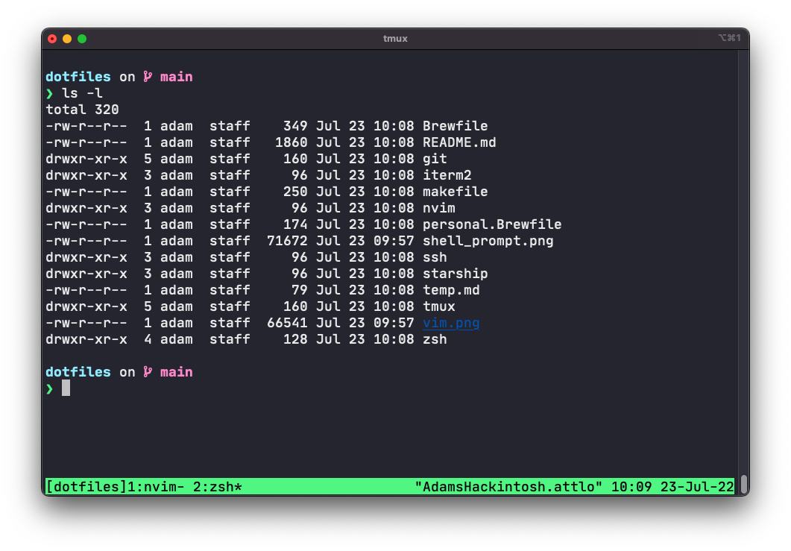
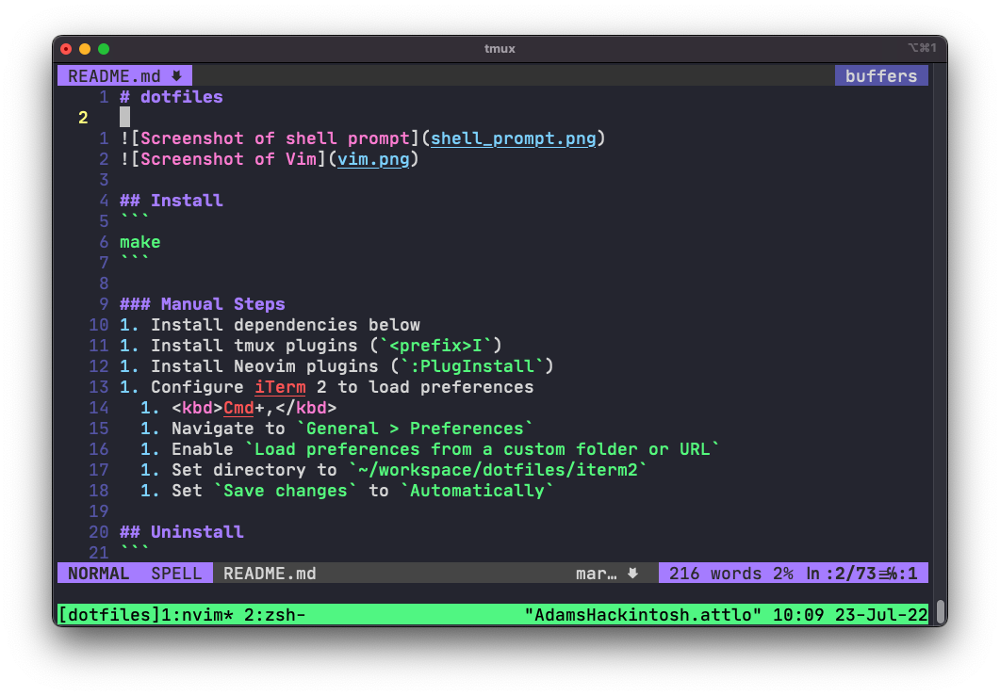

# dotfiles




## Install
1. `./install`
1. Configure iTerm 2 to load preferences
  1. <kbd>Cmd+,</kbd>
  1. Navigate to `General > Preferences`
  1. Enable `Load preferences from a custom folder or URL`
  1. Set directory to `~/workspace/dotfiles/iterm2`
  1. Set `Save changes` to `Automatically`

## Uninstall
```
make delete
```

## Features

### Cross-platform

Support for macOS, Ubuntu, and devcontainers.

### Feedback on Problems

Neovim's LSP diagnostic framework provides the core functionality.
The custom dictionary is stored at `~/.config/nvim/spell`.

Vim spell provides spell checking.
- `<Leader>s` to toggle spelling highlighting
- `zg` to add a word to the dictionary

[null-ls](https://github.com/jose-elias-alvarez/null-ls.nvim) provides diagnostic information using:
- [Vale](https://docs.errata.ai/) for writing

[Trouble](https://github.com/folke/trouble.nvim) provides a pretty list of problems.
- `:ToggleTrouble` to activate the list

## VS Code Keyboard Shortcuts

- `Control+Option+Command+l`: go to line in GitHub
- `Control+Option+Command+c`: go to commit in GitHub

## Vim Keyboard Shortcuts

### Finding / Searching

- `<Leader>f`: live grep based find using Telescope
- `:FindInFolder "some/path"`: live grep based find within a folder using Telescope
- `<Leader>o`: find git tracked files using FZF

Within Telescope:
- `[n]p`: toggle preview panel

Within FZF:
- `<C-/>`: toggle preview panel

GitHub integration:
- `:GBrowse`: Go to file at GitHub in browser
- `<Leader>g`: Go to selected line(s) at GitHub in browser
