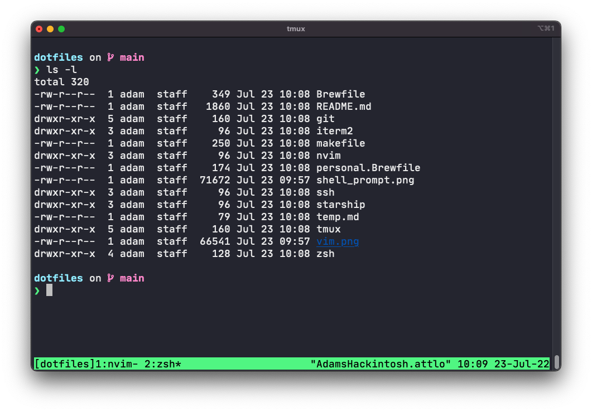
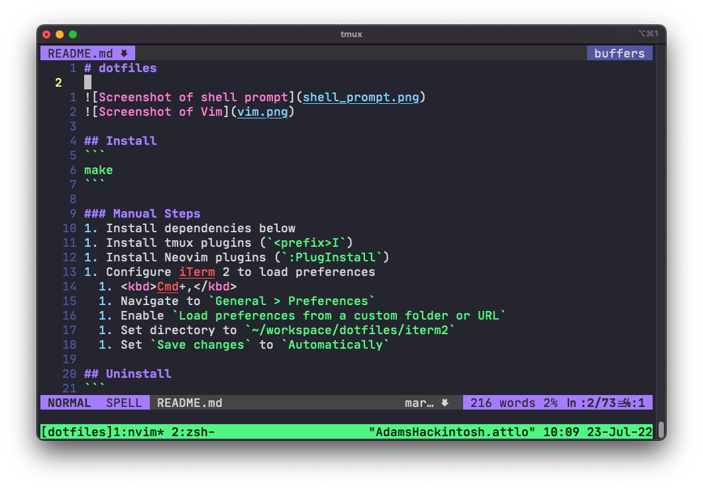

# dotfiles




## Install
1. `./install`

## Uninstall
```
make delete
```

## Features

### Cross-platform

Support for macOS, Ubuntu, and devcontainers.

### Named terminal sessions

Press `Ctrl+G` in the shell or tmux `prefix` then `g` to search sessions created by `amux-sessionizer`. Type a short descriptor such as `upgrade rspec` or `409 investigate`, then press Enter to open the selected session or create one when nothing matches. New sessions start in the current directory.

Press `Ctrl+N` to create the typed name even when fuzzy matches exist, or Esc to cancel. Spaces are preserved; dots and colons become underscores for tmux.

Highlight an existing session to preview its nugget summary, including linked PRs, required checks, reviews, and dependencies. The preview appears below the session list and takes up two-thirds of the picker height. The panel uses `nug session view`, reusing cached GitHub data for five minutes. When data is missing or stale, it shows a loading message while fetching and caching the updated summary. If GitHub is unavailable, nugget warns and falls back to saved data. Install nugget to enable previews.

The terminal title uses the session name; tmux windows show the process running in them. Reopening an existing amux session restores automatic window naming.

Each amux session gets a UUID exported as both `AMUX_SESSION_ID` and `NUGGET_SESSION_ID`, allowing [nugget](https://github.com/noizwaves/nugget) to track its work. The UUID survives reopening and renaming; recreating a killed session gets a new UUID. Python 3 is required to create an identity.

For sessions created before UUID support, reopen them with `amux-sessionizer`, then start a new window or pane to receive the variables. Existing shells and agents keep their original environment.

Names already used by other tmux sessions are reserved. To include an amux session created before ownership tracking, mark it once: `tmux set-option -t '=upgrade rspec:' @amux-sessionizer 1` (replace the name with your session).

You can also open a name directly: `amux-sessionizer "upgrade rspec"`. The existing `Ctrl+F` and tmux `prefix` then `f` shortcuts still open the directory picker.

### Feedback on Problems

Neovim's LSP diagnostic framework provides the core functionality.
The custom dictionary is stored at `~/.config/nvim/spell`.

Vim spell provides spell checking.
- `<Leader>s` to toggle spelling highlighting
- `zg` to add a word to the dictionary

[null-ls](https://github.com/jose-elias-alvarez/null-ls.nvim) provides diagnostic information using:
- [Vale](https://docs.errata.ai/) for writing

[Trouble](https://github.com/folke/trouble.nvim) provides a pretty list of problems.
- `:ToggleTrouble` to activate the list

## Updating Vim Plugins

Open Neovim and run `:PlugUpdate` to update all plugins managed by [vim-plug](https://github.com/junegunn/vim-plug).
To install newly added plugins, run `:PlugInstall`.

After removing plugins from the config, run `:PlugClean` to remove the installed files.

## VS Code Keyboard Shortcuts

- `Control+Option+Command+l`: go to line in GitHub
- `Control+Option+Command+c`: go to commit in GitHub

## Vim Keyboard Shortcuts

See [docs/neovim-keymap.md](docs/neovim-keymap.md) for the full custom keymap reference.
